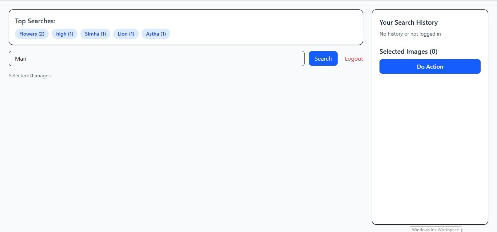
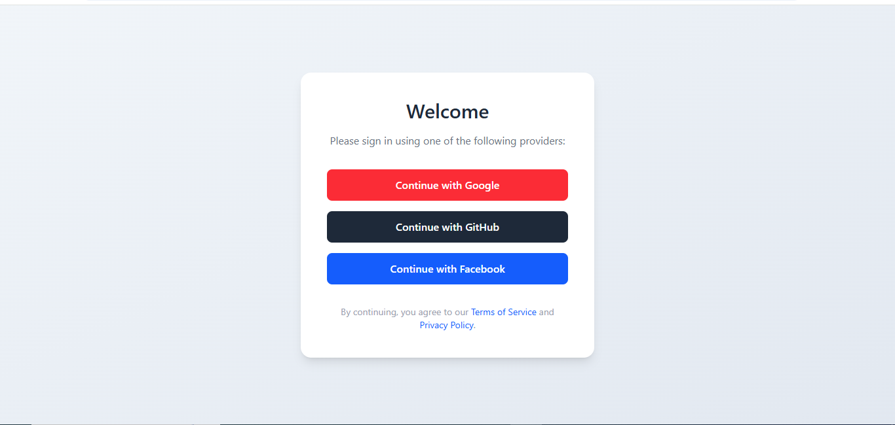
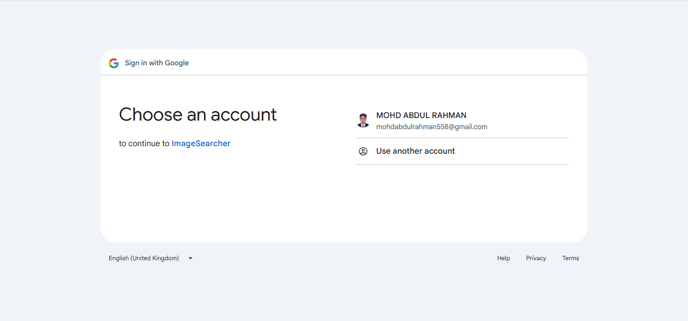
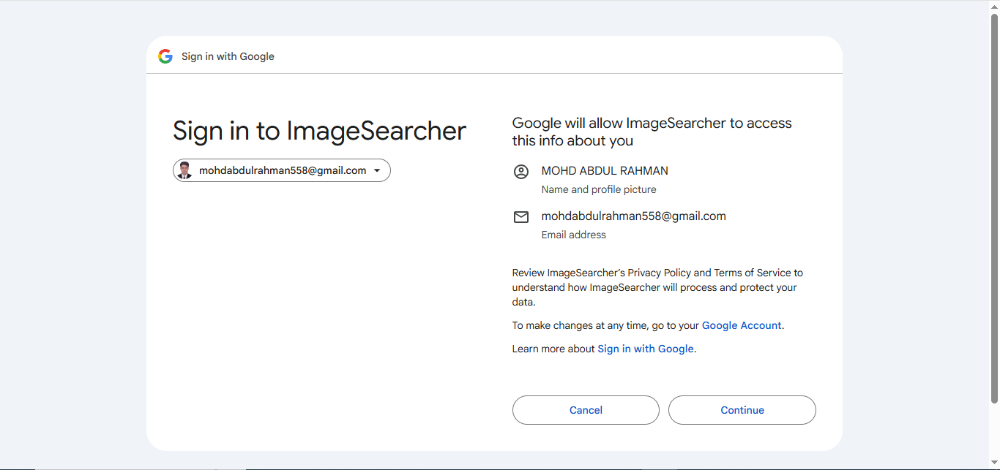
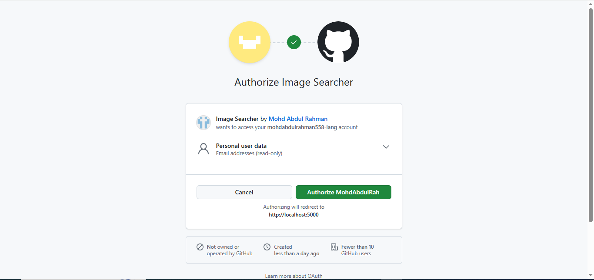
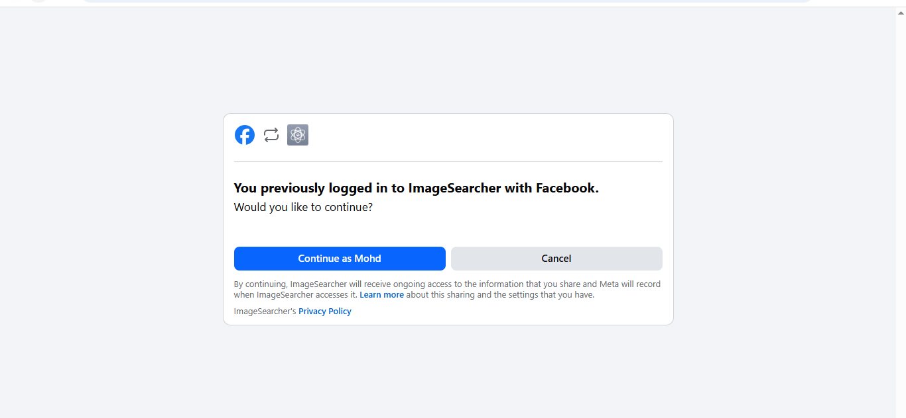
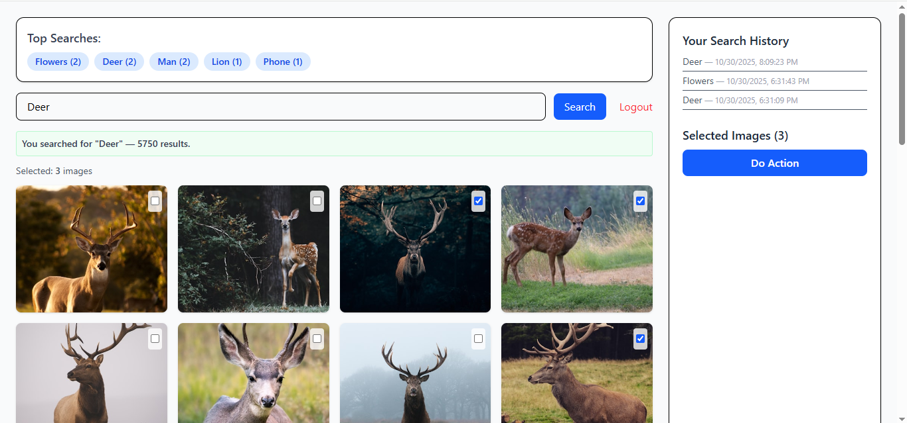
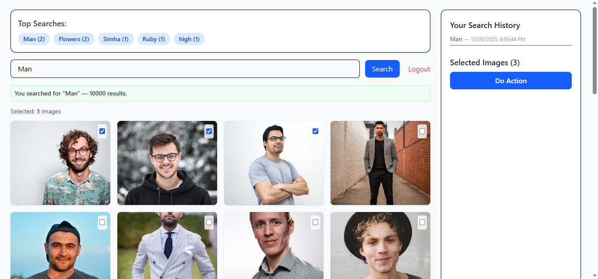

# 🖼️ Image Search & Multi-Select App (MERN + OAuth)

A full-stack image search web app built with the **MERN stack (MongoDB, Express, React, Node.js)** and **OAuth authentication (Google, GitHub, Facebook)**.  
Only authenticated users can search for images (via Unsplash API), view top searches, maintain personal history, and multi-select images.

---

## 🚀 Features

✅ **OAuth Authentication** — Google, GitHub, Facebook login (via Passport.js)  
✅ **Top Searches Banner** — shows top 5 most frequent search terms  
✅ **Unsplash Integration** — search images via Unsplash API  
✅ **Search History** — each user’s personal past searches stored in MongoDB  
✅ **Multi-Select Grid** — select multiple images with a dynamic counter  
✅ **Logout Support** — session-based authentication with cookies  
✅ **Full MERN Stack** — React frontend + Express/Node backend + MongoDB  

---

## 🏗️ Tech Stack

| Layer | Technology |
|--------|-------------|
| **Frontend** | React + Vite + Tailwind CSS |
| **Backend** | Node.js + Express.js |
| **Database** | MongoDB (Mongoose ODM) |
| **Authentication** | Passport.js (Google, GitHub, Facebook OAuth) |
| **API** | Unsplash API |
| **State Management** | React Hooks |
| **Environment** | Vite + dotenv |

---

## 🗂️ Folder Structure

```
/client             # React frontend (Vite)
/server             # Express backend
  ├── config/       # Passport + OAuth setup
  ├── routes/       # API endpoints
  ├── models/       # MongoDB models
  ├── controllers/  # Logic for each route
  └── server.js     # Main server file
.env                # Environment variables
```

---

## ⚙️ Environment Variables

### In `/server/.env`
```
PORT=5000
MONGO_URI=your_mongo_connection_string
SESSION_SECRET=longrandomsecret
CLIENT_ORIGIN=http://localhost:3000

# Unsplash API
UNSPLASH_ACCESS_KEY=your_unsplash_access_key

# Google OAuth
GOOGLE_CLIENT_ID=your_google_client_id
GOOGLE_CLIENT_SECRET=your_google_client_secret
GOOGLE_CALLBACK=http://localhost:5000/auth/google/callback

# GitHub OAuth
GITHUB_CLIENT_ID=your_github_client_id
GITHUB_CLIENT_SECRET=your_github_client_secret
GITHUB_CALLBACK=http://localhost:5000/auth/github/callback

# Facebook OAuth
FACEBOOK_CLIENT_ID=your_facebook_app_id
FACEBOOK_CLIENT_SECRET=your_facebook_app_secret
FACEBOOK_CALLBACK=http://localhost:5000/auth/facebook/callback
```

### In `/client/.env`
```
VITE_API_BASE=http://localhost:5000
```

---

## 🛠️ Installation & Setup

### 1️⃣ Clone the repository
```bash
git clone https://github.com/MohdAbdulRah/mern-oauth-image-search.git
cd mern-oauth-image-search
```

### 2️⃣ Setup backend
```bash
cd server
npm install
```

### 3️⃣ Setup frontend
```bash
cd ../client
npm install
```

### 4️⃣ Run both servers
From the root folder, use **concurrently** (optional):
```bash
npm run dev
```
Or manually:
```bash
# Terminal 1
cd server && npm start

# Terminal 2
cd client && npm run dev
```

Visit → **http://localhost:5173**

---

## 🌐 API Endpoints

| Method | Endpoint | Description |
|---------|-----------|-------------|
| `GET` | `/api/top-searches` | Get top 5 most frequent search terms |
| `POST` | `/api/search` | Perform an image search and save term |
| `GET` | `/api/history` | Fetch logged-in user’s search history |
| `GET` | `/auth/google` | Login with Google |
| `GET` | `/auth/github` | Login with GitHub |
| `GET` | `/auth/facebook` | Login with Facebook |
| `GET` | `/auth/logout` | Logout current user |

---

## 🧩 Frontend Overview

**Components:**
- `Login.jsx` — OAuth login screen with buttons (Google, GitHub, Facebook)
- `SearchPage.jsx` — main dashboard with:
  - Top Searches banner  
  - Search bar  
  - Image grid (4-column responsive)  
  - Multi-select counter  
  - Search history sidebar

---

## 📸 Screenshots / GIFs
### Home Page



After clicking on search it redirects to the Login Page if the user isn't logged in.

### OAuth Login 



### sample Google Login





### sample github login




### sample Facebook login



After login and if the user is logged in the user can search the images

### sample search






Top Searches appear above 

Search history appears rightside

Total images of the searched term appear below search bar

Number of selected images also appears rightside

---

## 📬 Postman / cURL Examples

### Example: Search
```bash
curl -X POST http://localhost:5000/api/search -H "Content-Type: application/json" -d '{"term": "mountains"}' --cookie "connect.sid=<session_cookie>"
```

### Example: Get Top Searches
```bash
curl http://localhost:5000/api/top-searches
```

---

## 🔒 Authentication Flow (OAuth)
1. User clicks **Login with Google / GitHub / Facebook**.  
2. Redirects to the provider’s consent page.  
3. On success, redirects to `/auth/<provider>/callback`.  
4. Server creates/fetches user and stores session in MongoDB.  
5. User can now access `/api/search`, `/api/history`, etc.

---

## 🧠 Future Improvements
- 🔖 Add user collections / favorites  
- 📦 Download selected images  
- 🌓 Dark mode UI  
- 📈 Analytics dashboard for searches  

---

## 👨‍💻 Developer
**Author:** Mohd Abdul Rahman  
**Mentor:**  Founder & CEO, UD Studios  
**Duration:** Internship Project — 7 Days  

---

